# Исследование утечек памяти приложения

## <a id="memoryleaks-structure"/> Навигация
- [Краткое описание](#memoryleaks-structure)
- [Меню](#page-menu)
  - [Сценарий 1 (FullScreen API)](#page-menu-1)
- [Форум](#page-forum)
  - [Сценарий 1 (Создание темы)](#page-forum-1)
  - [Сценарий 2 (Переход на страницу темы)](#page-forum-2)
- [Профиль](#page-profile)
  - [Сценарий 1 (Изменение аватара)](#page-profile-1)
  - [Сценарий 2 (Изменение данных)](#page-profile-2)
  - [Сценарий 3 (Изменение пароля)](#page-profile-3)
- [Таблица лидеров](#page-leaderboard)
  - [Сценарий 1 (Взаимодействие с таблицей)](#page-leaderboard-1)
- [Авторизация](#page-login)
  - [Сценарий 1 (Ввод данных и отправка формы)](#page-login-1)
- [Регистация](#page-register)
  - [Сценарий 1 (Без ошибок валидации)](#page-register-1)
  - [Сценарий 2 (С ошибками валидации)](#page-register-2)
- [Игра](#page-game)
  - [Сценарий 1 (Бездействие пользователя)](#page-game-1)
  - [Сценарий 2 (Взаимодействие с игрой)](#page-game-2)
- [404](#page-404)
  - [Сценарий 1 (404)](#page-404-1)
- [WEB-Приложение](#app)
  - [Сценарий 1 (Переходы между страницами)](#app-1)
- [Результаты исследования](#сonclusion)

## <a id="memoryleaks-structure"/> Краткое описание

Исследование утечек памяти приложения проведено с использованием инстумента из dev-консоли (вкладка Performance) 🛠  
На каждой странице проведены замеры используемой памяти при различных сценариях действий пользователя и проведен дальнейший анализ собранных сведений. 

Более подробная информация по каждой из исследуемых станиц приложения представлена ниже

## <a id="page-menu"/> Меню 

Страница Меню предназначена для навигации по приложению. Каких-либо вариаций действий пользователя в результате которых не осуществлялся бы переход на дургие страницы приложения не много.

- ### <a id="page-menu-1"/> Сценарий 1 - ✅
  ####  Описание действий пользователя
  В данном пункте исследования также анализировались возможные утечки памяти при использовании Fullscreen WEB API.
  #### График
  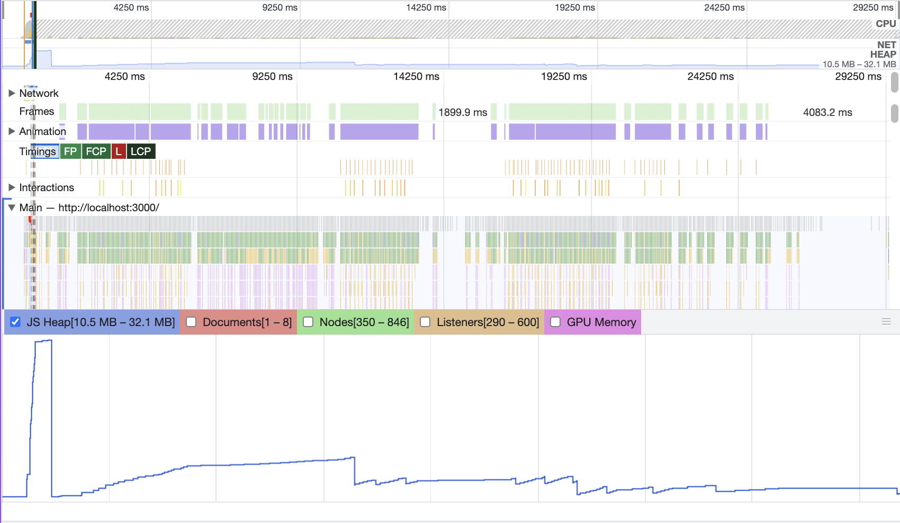
  
Скачек памяти в начале графика - обновление страницы меню. Дальнейший постепенный рост - многократные переходы в режим "на весь экарн" и обратно. После чего происходила сборка мусора с возвращением объема использумой памяти в "начальное" состояние (в рамках допустимой погрешности).

## <a id="page-forum"/> Форум

- ### <a id="page-forum-1"/> Сценарий 1 - ✅
  ####  Описание действий пользователя
  Многократное повторение следующих действий:
  - Нажатие кнопки "создать тему";
  - Нажатие кнопки "отпавить" без ввода информации в поля формы (в результате валидации отображаются сообщения об ошибке);
  - Ввод данных в поля формы;
  - Закрытие модального окна (на момент проведения исследования отправка данных не реализована).
  #### График
  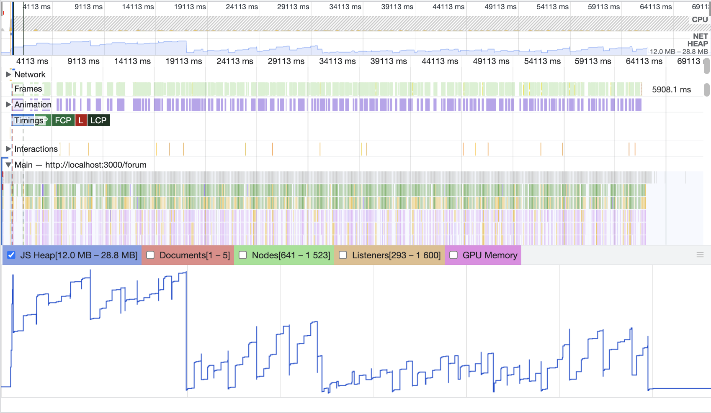
  
Наблюдается возврат к "начальному" объему памяти после "сборки мусора".

- ### <a id="page-forum-2"/> Сценарий 2 - ✅
  ####  Описание действий пользователя
  Многократное повторение следующих действий:
  - Переход на страницу "тема форума" по клику на название темы;
  - Возврат на страницу "Форум".
  #### График
  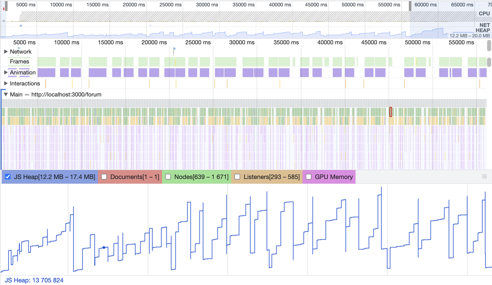
  
Наблюдается возврат к "начальному" объему памяти после "сборки мусора".

  
## <a id="page-profile"/> Профиль 

- ### <a id="page-profile-1"/> Сценарий 1 - ✅
  ####  Описание действий пользователя
  Многократное повторение следующих действий:
  - Загрузка аватара пользователя.
  #### График
  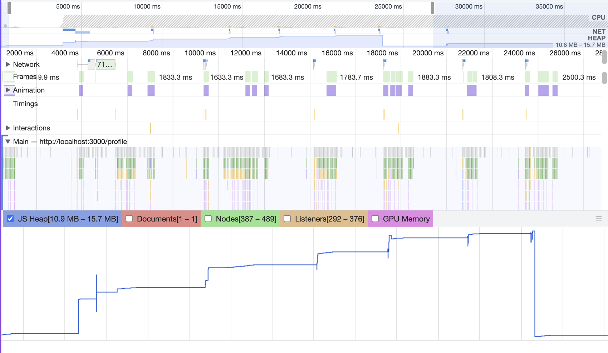
  
Наблюдается возврат к "начальному" объему памяти после "сборки мусора".

- ### <a id="page-profile-2"/> Сценарий 2 - ✅
  ####  Описание действий пользователя
  Многократное повторение следующих действий:
  - Изменение данных пользователя (открытие модального окна, изменение данных, сохранение формы).
  #### График
  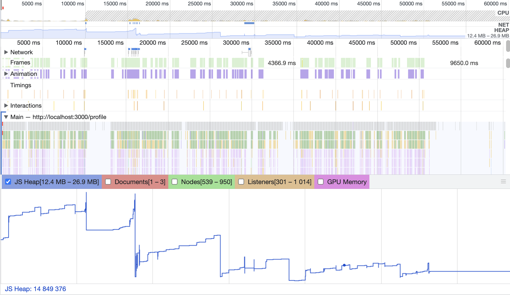
  
Наблюдается возврат к "начальному" объему памяти после "сборки мусора".

- ### <a id="page-profile-3"/> Сценарий 3 - ✅
  ####  Описание действий пользователя
  Многократное повторение следующих действий:
  - Изменение пароля пользователя (открытие модального окна, изменение пароля, сохранение формы).
  #### График
  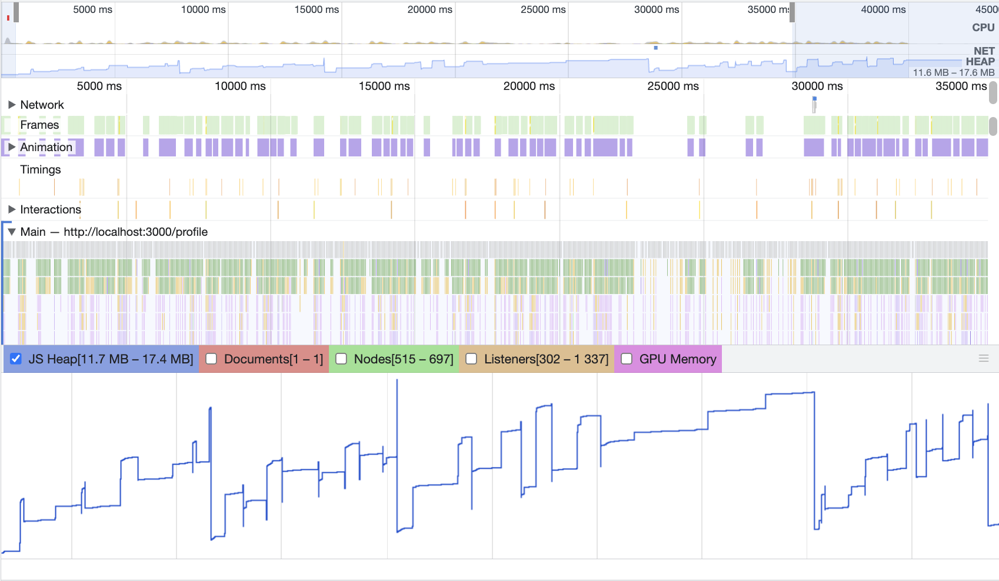
  
Наблюдается возврат к "начальному" объему памяти после "сборки мусора".

## <a id="page-leaderboard"/> Таблица лидеров 
- ### <a id="page-leaderboard-1"/> Сценарий 1 - ✅
  ####  Описание действий пользователя
  Многократные клики по кнопкам в шапке таблицы.
  #### График
  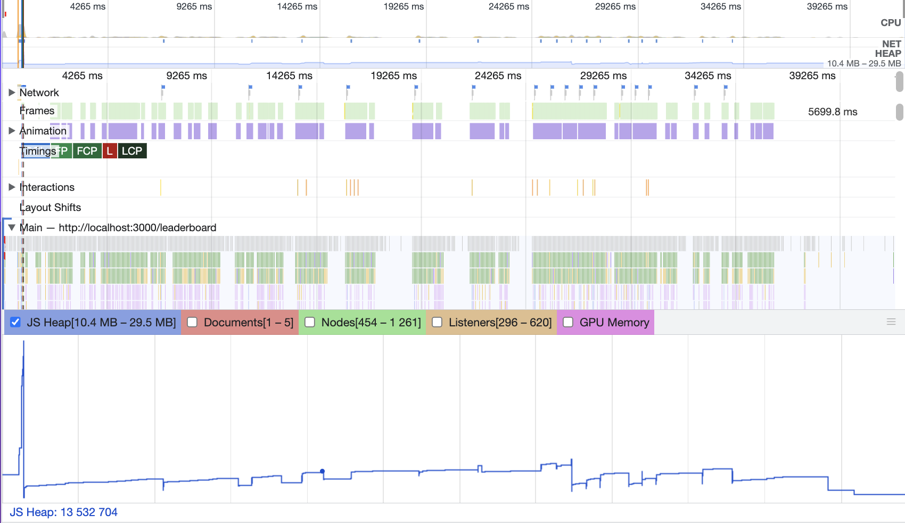
  
Наблюдается возврат к "начальному" объему памяти после "сборки мусора".

  
## <a id="page-login"/> Авторизация 
- ### <a id="page-login-1"/> Сценарий 1 - ✅
  ####  Описание действий пользователя
  - Ввод заведомо некорректных данных в поля формы;
  - Попытка отправки данных (вызов сообщений об ошибках валидации);
  - Исправление введенных данных в части полей;
  - Многократная повторая попытка отправки данных (ошибка валидации);
  - Исправление введенных данных во всех поляx;
  - Отправка данных формы на сервер;
  - Получаение ОК от сервера;
  - Переход в меню.

  #### График
  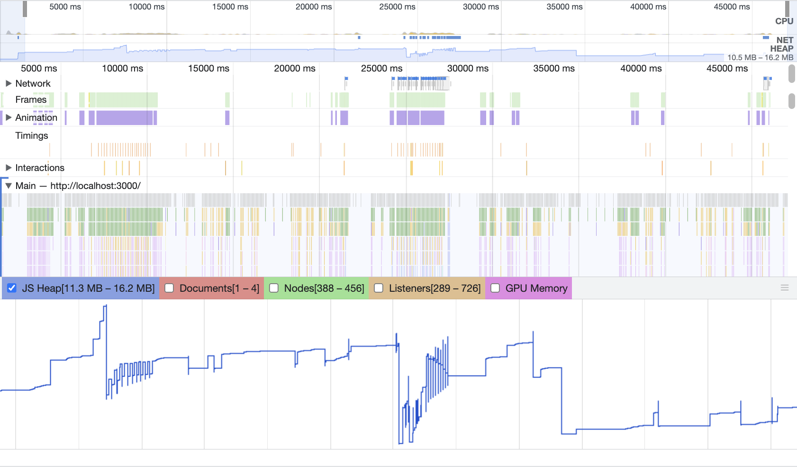
  
Наблюдается возврат к "начальному" объему памяти после "сборки мусора".

## <a id="page-register"/> Регистация 
- ### <a id="page-register-1"/> Сценарий 1 - ✅
  ####  Описание действий пользователя
  - Ввод заведомо некорректных данных в поля формы;
  - Попытка отправки данных (вызов сообщений об ошибках валидации);
  - Исправление введенных данных во всех поляx;
  - Отправка данных формы на сервер;
  - Получаение ОК от сервера;
  - Переход в меню.

  #### График
  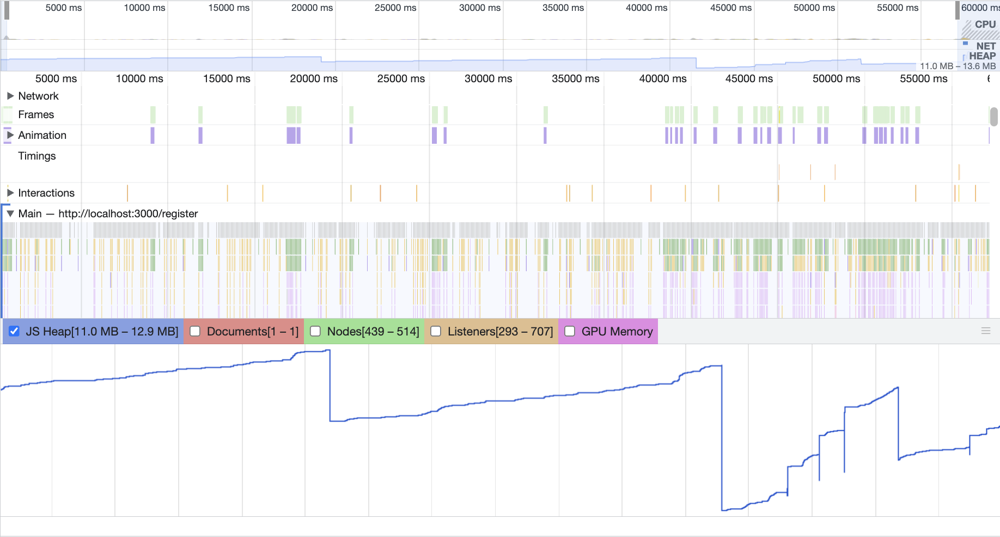
  
Наблюдается возврат к "начальному" объему памяти после "сборки мусора".

- ### <a id="page-register-2"/> Сценарий 2 - ✅
  ####  Описание действий пользователя
  - Ввод корректных данных в поля формы;
  - Отправка данных формы на сервер;
  - Получаение ОК от сервера;
  - Переход в меню.

  #### График
  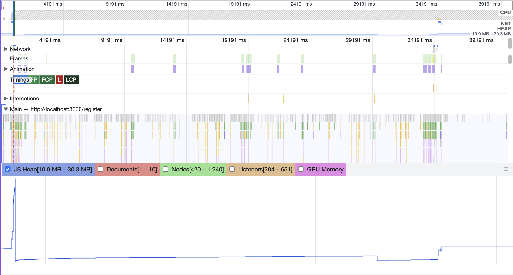
  
Наблюдается возврат к "начальному" объему памяти после "сборки мусора".

## <a id="page-game"/> Игра 
- ### <a id="page-game-1"/> Сценарий 1 - ✅
  ####  Описание действий пользователя
  - Запуск игры
  - Отсутствие каких-либо действий со стороны пользователя до завершения игры (проигрыш по достижении 5 врагами конца карты)

  #### График
  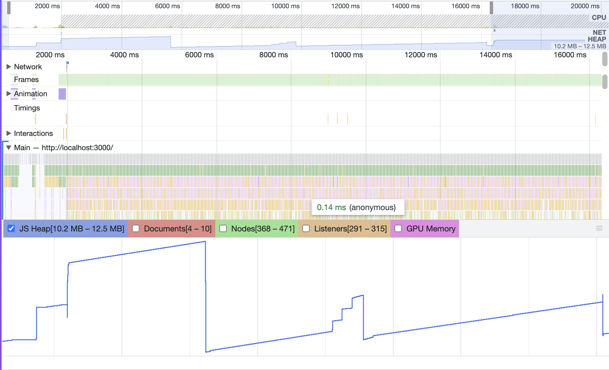
  
Наблюдается рост используемой памяти. При этом, после "сборки мусора" возврат к "начальному" объему памяти.

- ### <a id="page-game-2"/> Сценарий 2 - ✅
  ####  Описание действий пользователя
  - Запуск игры
  - Стройка нескольких башен
  - Наведение курсора мыши на свободные плитки

  #### График
  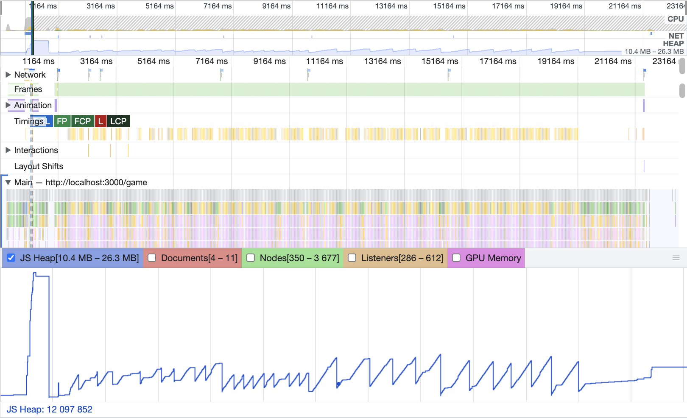
  
Наблюдается рост используемой памяти. При этом, после "сборки мусора" возврат к "начальному" объему памяти.

## <a id="page-404"/> 404 
- ### <a id="page-404-1"/> Сценарий 1 - ✅
  ####  Описание действий пользователя
  - Ввод в адресную строку пути незарегистрированной страницы
  - Переход на старницу 404.
  - Наблюдение за экраном... 👀
  - Завершение записи данных

  #### График
  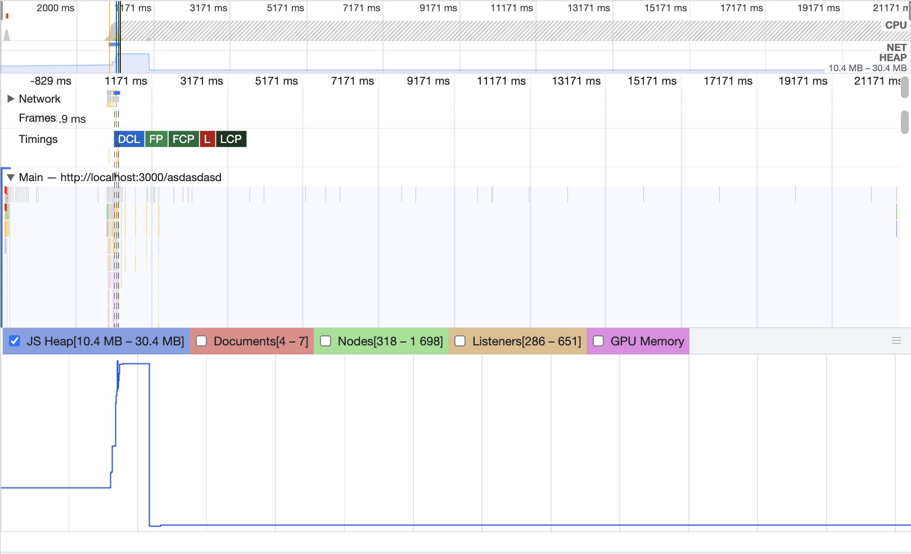
  
Утечек памяти в данном сценарии не зафиксировано.

## <a id="app"/> WEB-Приложение 
- ### <a id="app-1"/> Сценарий 1 - ✅
  ####  Описание действий пользователя
  - Загрузка страницы меню
  - Переходы на различные страницы приложения с возвратом обратно в меню
  - Выход (Logout)
  - Переход на страницу Авторизации
  - Переход на страницу Регистрации
  - Возврат в меню

  #### График
  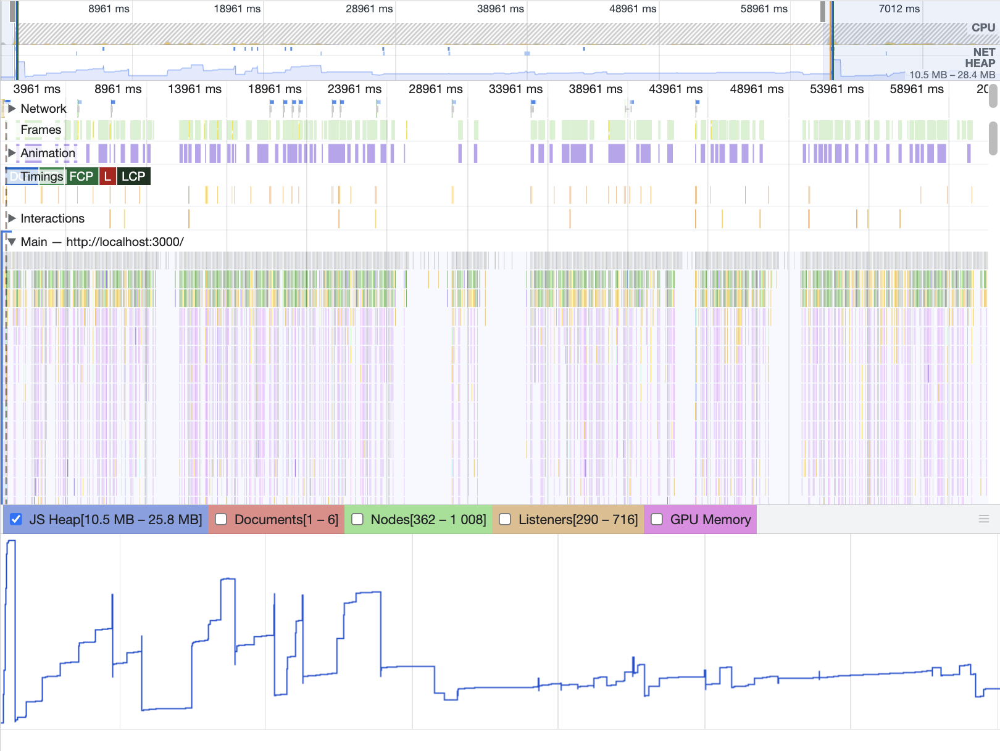
  
Утечек памяти в данном сценарии не зафиксировано.

## <a id="сonclusion"/> Результаты исследования 

В результате анализа полученных данных каких-либо явных признаков наличия утечек памяти в приложении <b><u>не выявлено</u></b>. 
